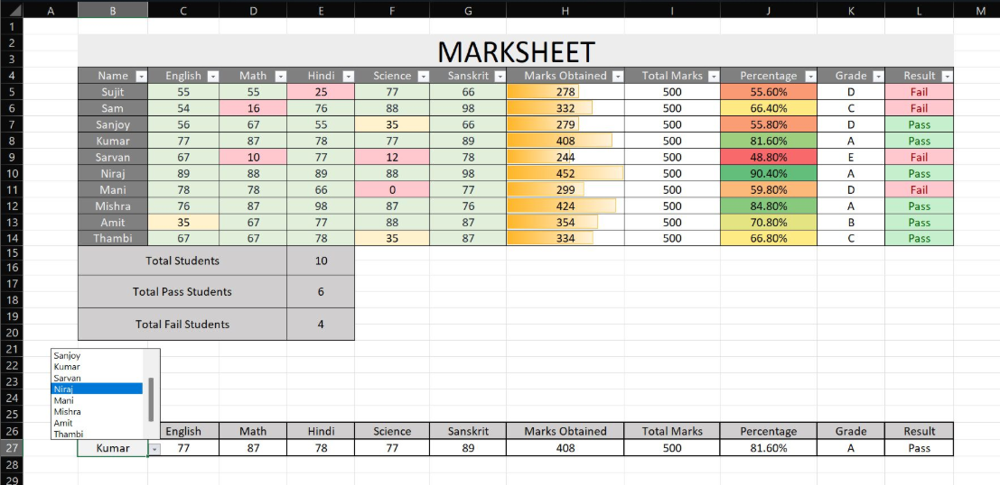

📊 Dynamic Excel Student Marksheet

An interactive Excel-based marksheet using formulas, data validation, and conditional formatting to analyze student performance.

✅ Features
  - Conditional formatting for scores and performance
  - Automated total and percentage calculation
  - Dynamic pass/fail logic using IF, AND, IFS
  - Data bars and color scales for visualization
  - Drop-down list to select student and view individual performance

📁 Files Included
  - `Dynamic_Student_Marksheet.xlsx`
  - `marksheet_preview.png`

🧠 Excel Functions Used
  - `SUM`, `IF`, `IFS`, `AND`
  - `COUNTIF`, `COUNTA`
  - Conditional formatting
  - Data validation

🔍 Preview

---

Created with ❤️ by Sneha Bhagat
